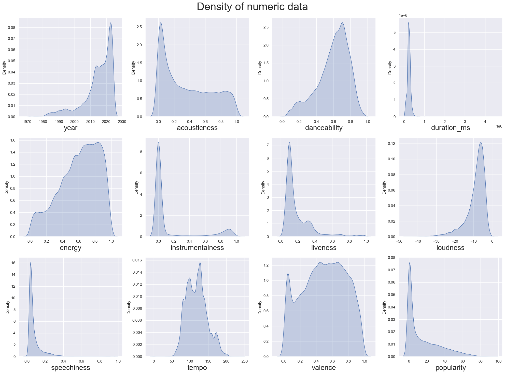
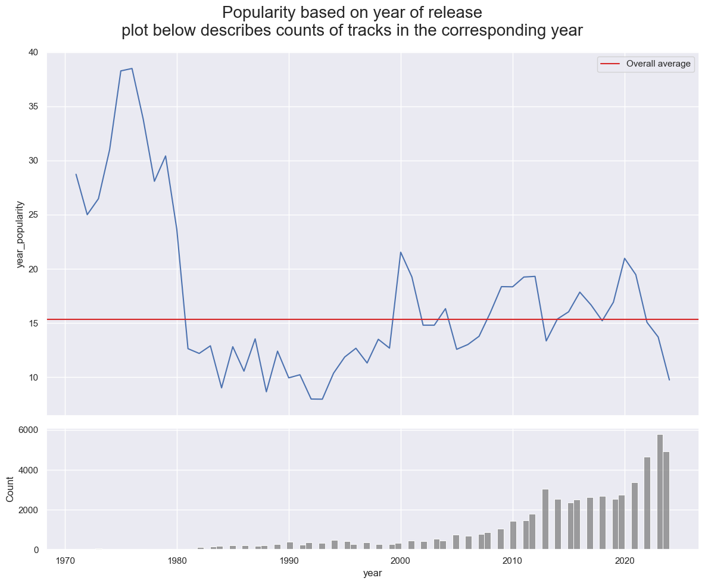
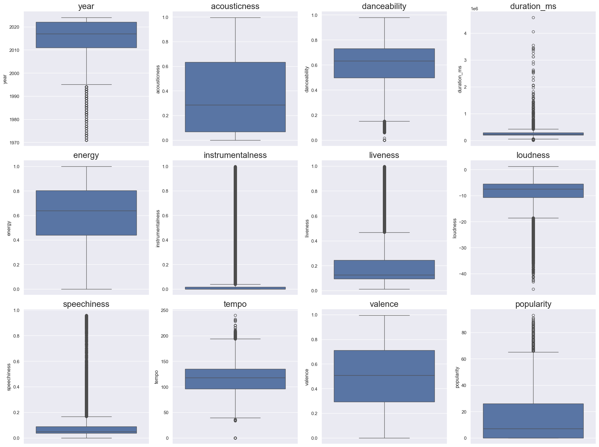
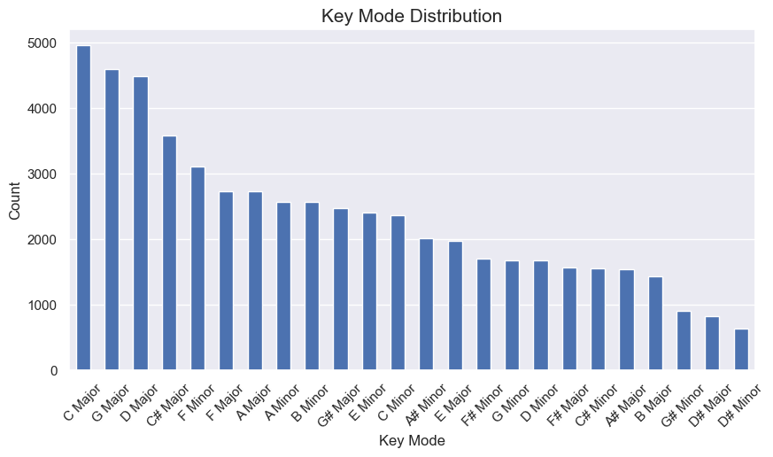
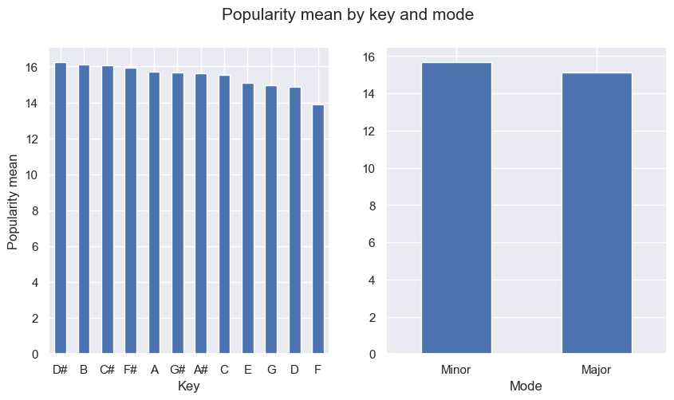
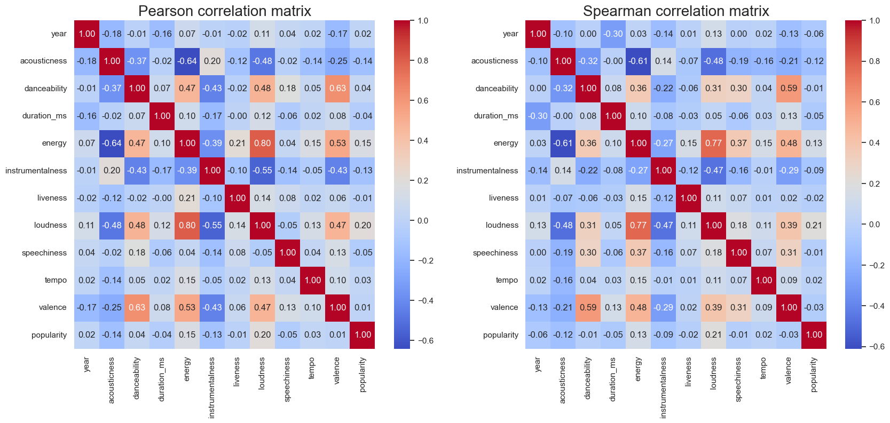
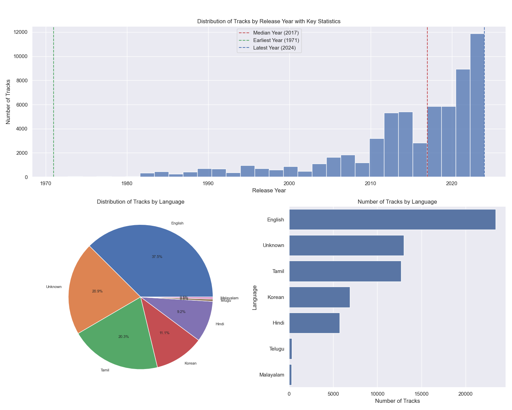
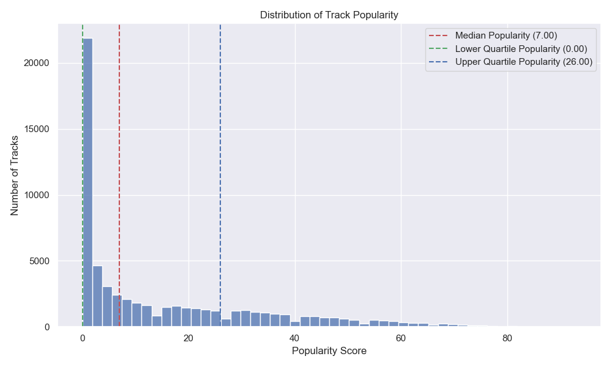
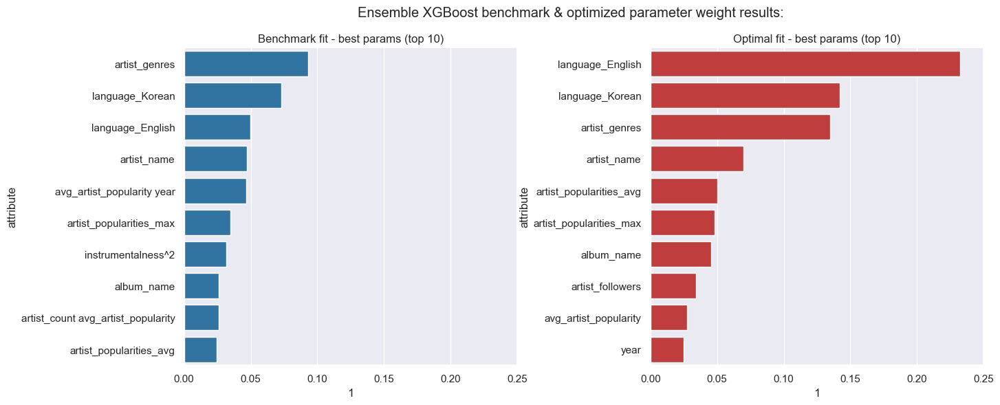

# pridav-music-project

Modeling &amp; analysis of music popularity across different genres and artists - project for 1-DAV-302/20 - priDAV

## 1. Research Questions and Project Goals

### Main Research Questions

1. Is the data representative on a global scale and release year basis?
2. Which musical attributes have the greatest impact on track popularity?
3. To what extent do acoustic vs artist attributes influence overall track popularity?

### Project Objectives

- Analyze relationships between various music track attributes and their popularity
- Develop a model to predict music track popularity
- Identify key factors contributing to model performance

## 2. Tools and Technologies

### Programming Languages and Libraries

#### Languages

- Python

#### Libraries

1. Scrapers:
- requests, pandas, time, typing, os, dotenv, tqdm
2. Data Processing and Analysis:
- numpy, pandas, matplotlib, seaborn, warnings, ...
3. Machine Learning:
- sklearn, xgboost, os, sys, numpy, pandas, dotenv, ...

### Development Tools

- GitHub
- Jupyter Notebook
- Visual Studio Code or other IDE

## 3. Data Sources and Processing

### Data Sources

#### 1. Kaggle Spotify Dataset

- Data collected from a Kaggle dataset
    - Couldn't be collected through a scraper due to Spotify removing access for new developer accounts for some Data Points of it's Web API, including the Audio Features, as of late November 2024 ([link to relevant article](https://www.digitalmusicnews.com/2024/12/01/spotify-tightens-api-access-removes-several-data-points/))
- Link to dataset: [Spotify Tracks Dataset](https://www.kaggle.com/datasets/gauthamvijayaraj/spotify-tracks-dataset-updated-every-week/data)
- Author: [Gautham Vijayaraj](https://www.kaggle.com/gauthamvijayaraj)
- Last updated: December 9th 2024
- Contains track information and audio features
- Includes:
  - Track Identifiers:
    - `track_id` - Unique Spotify track identifier
    - `track_url` - URL to the track on Spotify
  - Basic Metadata:
    - `track_name` - Name of the track
    - `artist_name` - Name(s) of the artist(s)
    - `album_name` - Name of the album
    - `year` - Release year
    - `artwork_url` - URL to album artwork
    - `language` - Track language
  - Target Variable:
    - `popularity` - Track popularity score
  - Audio Features:
    - `acousticness` - Confidence measure of acoustic sound
    - `danceability` - How suitable for dancing
    - `energy` - Perceptual measure of intensity
    - `instrumentalness` - Prediction of no vocal content
    - `liveness` - Presence of audience in the recording
    - `loudness` - Overall loudness in decibels
    - `speechiness` - Presence of spoken words
    - `valence` - Musical positiveness measure
  - Musical Attributes:
    - `duration_ms` - Track length in milliseconds
    - `key` - Key of the track
    - `mode` - Modality (major or minor)
    - `tempo` - Estimated tempo in BPM
    - `time_signature` - Estimated time signature

#### 2. Spotify API

- Data collected through Spotify Web API
- Contains additional track and artist information for Kaggle dataset records
- Last scraped: December 28th 2024
- Includes:
  - Track Reference:
    - `track_id` - Matching ID from Kaggle dataset
    - `track_name` - Track name for verification
  - Artist Information:
    - `artist_count` - Number of artists on the track
    - `artist_ids` - Spotify IDs for all artists
    - `artist_names` - Names of all artists
  - Artist Metrics:
    - `artist_popularities` - Popularity scores for all artists
    - `artist_followers` - Follower counts for all artists
    - `artist_genres` - Genre tags for all artists
  - Additional Metric:
    - `avg_artist_popularity` - Average popularity score for all artists
        - was calculated by averaging the `artist_popularities` column during the scraping process
        - was removed from modeling due to direct implementation in the pipeline

### Data Collection Process

#### 1. spotify_scraper.py:

- <strong>Not used because of deprecated endpoints</strong>
- Endpoint used:
    - `https://api.spotify.com/v1/playlists/{playlist_id}/tracks`
        - [link to documentation](https://developer.spotify.com/documentation/web-api/reference/get-playlists-tracks)
- Deprecated endpoints:
    - `https://api.spotify.com/v1/browse/categories/{category}/playlists`
        - [link to documentation](https://developer.spotify.com/documentation/web-api/reference/get-a-categories-playlists)
    - `https://api.spotify.com/v1/audio-features/{track_id}`
        - [link to documentation](https://developer.spotify.com/documentation/web-api/reference/get-audio-features)
- Technical implementation:
    - Built with requests library for API calls
    - Uses basic error handling and retries
    - Simple rate limiting with time.sleep()
    - Synchronous processing of requests
    - Basic JSON response parsing
- Process:
    - Would have used category playlist endpoint to get playlist IDs,
    instead playlists were manually added
    - Uses playlist endpoint to gather basic track info in batches
    - Would have used audio features endpoint to get audio features data, instead this approach, and scraper,  was abandoned
    - Handles rate limiting with automatic retries
    - Outputs scraped data into a csv file
- Would have been used to create our own dataset similar to the Kaggle one

#### 2. Kaggle Dataset:

- Contains over 60,000 records of track data
- Provides audio features that are no longer accessible via API for new developer accounts
- Used as our primary data source due to API limitations

#### 3. artist_details_scraper.py:

- Enriches track data with additional artist information
- Endpoints used:
    - `https://api.spotify.com/v1/tracks/{list_of_track_ids}`
        - [link to documentation](https://developer.spotify.com/documentation/web-api/reference/get-several-tracks)
    - `https://api.spotify.com/v1/artists/{list_of_artist_ids}`
        - [link to documentation](https://developer.spotify.com/documentation/web-api/reference/get-multiple-artists)
- Technical improvements from the first scraper:
    - Added tqdm for progress tracking
    - Improved error handling with specific exception types
    - Separated output creation into a separate function for better code readability
- Process:
    - Reads track IDs from the Kaggle dataset
    - Fetches basic track details in batches
    - Extracts unique artist IDs from track responses
    - Fetches artist information in batches
    - Combines track and artist data
    - Handles rate limiting with automatic retries
    - Outputs enriched data into a csv file

### Data Cleaning

#### Data Quality Issues

Multiple steps were subject of the data quality control such as:
- Null controls
- Data anomalies/corrupted fields

Missing data in the source datasets was represented using value -1, we developed an ETL mechanism to automate conversion to np.NaN.

#### Preprocessing Steps

We have applied general recommended data preprocessing transformations as well as custom-defined transformations regarding some attributes.

General transformations:
- Scaling numerical data
- Encoding categorical data based on One-Hot encoding principle

Custom transformations:
- custom-defined encoding of categorical data
- custom-defined aggregation strategies

The following columns required custom preprocessing transformation to correctly represent information, standard categorical encoding would cause massive column addition to the dataset.

- Artist_name: encoded as frequency of the artist in the dataset
- Mode: encoded based on "Circle of Fifths" musical theory
- Artist_followers: list-like value, column independent, aggregation on row basis
- Artist_popularities: list-like value, column independent, aggregation on row basis
- Album_name: frequency occurance encoding

All of the numerical data (encoded data as well) has been standardized in nested pipelines.

Automated Pipeline Architecture:

<!-- INSERT IMAGE -->

### Data Storage

The data files are stored locally in the `Development/{student_handle}/Data` directory for each developer.

## 4. Analysis and Results

### Exploratory Data Analysis

<!-- TODO: Add key visualizations and findings -->
**Null analysis**

- NaNs represented by -1.0
- Only present in audio features

**Distribution analysis**

- Distributions implied outlier values
<!-- plot numeric distributions -->

- Possible bias of decreasing popularity with years due to smaller count of older tracks in the dataset
<!-- mean popularity by year with count plot -->

**Outlier analysis**

- We found there is a large amount of outliers in multiple columns such as *year, duration_ms, instrumentalness, liveness, loudness, speechiness and popularity*. 
- Notable - the mean popularity score is very close to 0, implying that only a fraction of songs become popular. This also proves that we shouldn't eliminate outliers.
<!-- boxplots grid -->
.
- The largerst amount of outliers were present in the instrumentalness attribute, where it seems most values are either very close to 0 or very close to 1.

**Categorical attributes**

- The highest mean popularity is among tracks of Korean language.
<!-- plot popularity by language -->

- Most prevalent Keys (Key signatures/ Scales) in the dataset were C, G, and D Major.
<!-- Keymode counts -->

- Popularity is evenly distributed throughout keys and modes.
<!-- keymode popularity mean plot-->

- Most prevalent time signature is 4/4 (common time) and other time signatures have negligable counts in comparison, which could imply this column would have little to no effect on predicting popularity.

**Correlation analysis**

We computed both spearman and pearson correlation matrices to look for values with highest correlations to popularity: 
<!-- Corr matrix plot -->

Columns with highest correlations to popularity:

positive:
- loudness (0.20)
- energy (0.15)

negative:
- acousticness (-0.14)
- instrumentalness (-0.13)
- speechiness (-0.05)

These could be the parameters with highest impact on popularity of a track.

**Normality testing**

- Shapiro-Wilk normality tests confirmed that no attributes in the dataset were normally distributed.

### Modeling

#### Linear models

**1. Linear Regression**

<!-- TO DO -->

**2. Ridge Regression**

<!-- TO DO -->

**3. Lasso Regression**

<!-- TO DO -->

#### Ensemble models

**1. XGBoost**

- Gradient boosting model optimized for performance
- Best Hyperparameters found:
  <!-- TO DO -->
- Model Performance:
  <!-- TO DO -->

**2. Random Forest**

- Ensemble of decision trees with bagging
- Was not optimized, as after 14 hours of running it did not complete, and then logging showed there was no actual progress being made
- Best Hyperparameters found:
  - `model__n_estimators`: 400
  - `model__max_depth`: None
  - `model__min_samples_split`: 10
  - `model__min_samples_leaf`: 3
- Model Performance:
  - MSE:  147.00475324692562
  - RMSE:  12.124551671997015
  - R2:  0.5877873398407145

### Key Findings

<!-- TODO: Add key findings -->
(Most important factors affecting popularity, variable relationships)

Key takeaway of the project is that we did not have enough data to reliably model popularity prediction, this lack of data is present both in attribute selection as well as proper
distribution of data in geographical and popularity terms. There are many songs which popularity is equal to 0, in addition the popularity average goes down with the year of release of the song
this might imply that older songs are more popular, however we must keep in mind that this could be due to bias because the counts on of the songs released before year 2000 are uncomparable in counts
to recent songs.

## 5. Conclusions and Limitations

### Conclusions

#### 1. Is the data representative on a global scale and release year basis?

No, there is a bias towards more recent releases with the earliest release year being 1971, latest being 2024, but the median being 2017.

There is also a bias towards specific languages, as there are only 6 different languages, plus an unknown category, represented in the dataset with unequal distribution.

We can see a clear bias towards **south-east asia** region, since the most prominent languages are of indian and korean origin, although english is present we must remember that english
is also used prelevantly in India.

The popularity is also not very well represented in the dataset, with the median score being only 7 on a scale from 0 to 100. Over 28% of the data has a score of 0.

#### 2. Which musical attributes have the greatest impact on track popularity?

To answer this question we will analyse the attribute weights form the best estimator (optimized XGBoost regressor).

According to the best XGBoost model with test R^2 ~ 0.6, the most important parameters were english and korean language as well as data regarding the artist - genre, artist popularity
and artist data aggregations, no acustic data was present, this means (as expected) that the author of the track as well as marketing elements regarding the producer are far more important
elements than acustic data.

Music production is an industry where artist & producer fame are the key driving factors - artist fame is the key indicator of track's success as consumers maily consume already existing and established producers.

<!-- TO DO -->

#### 3. To what extent do acoustic vs artist attributes influence overall track popularity?

<!-- TO DO -->

### Limitations

#### Data limitations

- Having to use a downloaded dataset instead of a scraped one limited our ability to collect less biased data and create a more representative dataset. It also narrowed our research options and sample size.
- The downloaded dataset also contained missing values, which could have been avoided if we had used a scraper.

#### Model limitations

- The Random Forest model was having running issues, so it had to be abandoned during the last steps, which left us with only one ensemble model.
